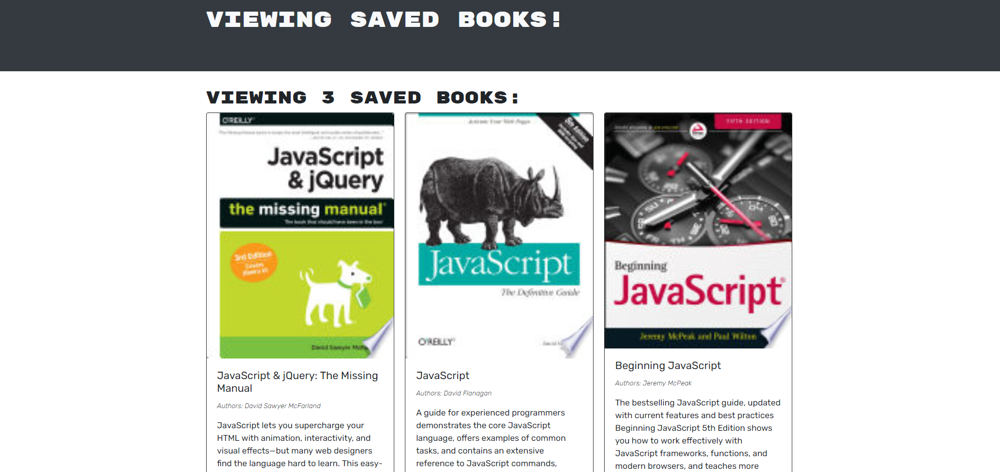

# Book Search

## Description
Having trouble keeping tracks of what books you have your eyes set on? Have trouble no longer! Book search is a simple program that is connected to the google books API database that allows you to search up books and save them. Additionally, you are able to look up additional books with our handy dandy search function. Google books also provide short descriptions for books if you are indecisive in your reading journey.
## Table of Contents
* [Usage](#usage)
* [License](#license)
* [Questions](#questions)
## Usage
Simply navigate to the website below
https://young-bayou-41268.herokuapp.com/
## License
This project is covered under the MIT license.
[Click here to see the terms of the license](https://choosealicense.com/licenses/mit/)
## Questions
Any questions or concerns?
Contact me on my github: [blazelim](https://github.com/blazelim/)

Or email me at: blazebentleycolim@gmail.com